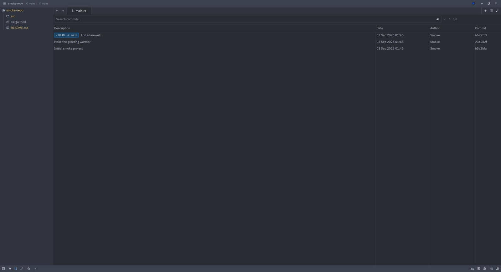
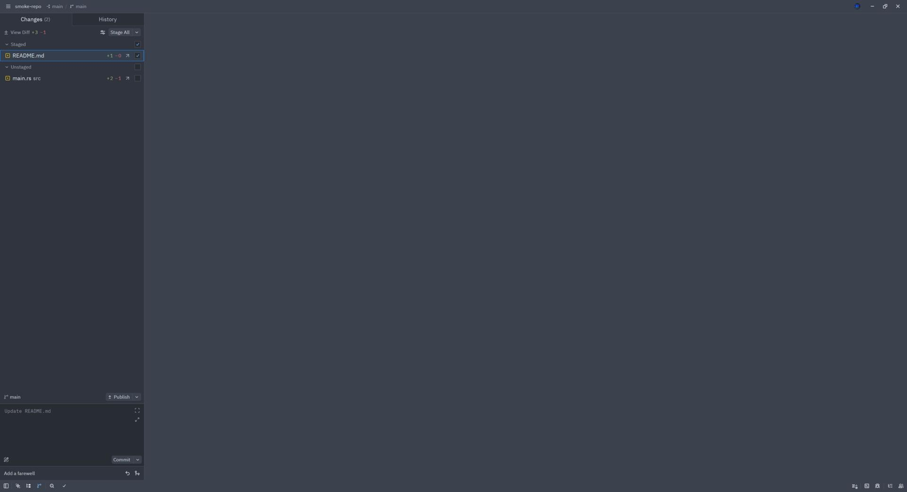
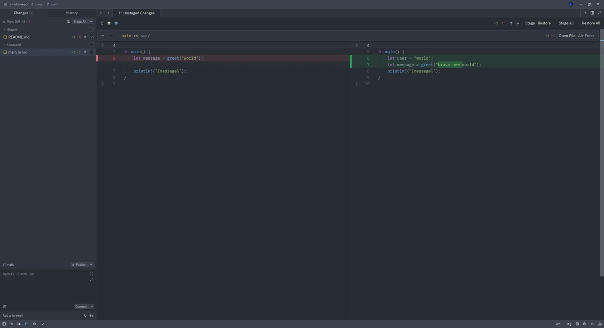

# What this fork adds

Everything below is in the `next` build and not in upstream Zed. Each entry
names the branch it comes from; the branches are the rows of
[NEXT_INTEGRATIONS.md](./NEXT_INTEGRATIONS.md), which records where the code
came from and when the fork can drop it. Settings go in your own
`settings.json`; the fork ships upstream defaults, so a feature with a setting
is off until you turn it on.

## Scroll over the tab bar to switch tabs

Point at the tab bar and scroll: the editor moves one tab per wheel notch,
the way VS Code does (a trackpad swipe counts every step, so a long swipe
walks several tabs). Holding Shift gives the plain tab-strip scroll instead,
and with the setting off, Shift-scrolling switches tabs. It stops at the
first and last tab instead of wrapping around, sideways scrolling still just
slides the tab strip, and the whole bar reacts: the tabs, the empty space next
to them, and the pinned row when pinned tabs sit in a row of their own. Turn
it on with `"tab_bar": { "scroll_to_switch_tabs": true }`, or in the settings
window under Window & Layout, Tab Bar, "Scroll To Switch Tabs". Importing VS Code settings picks it up from
`workbench.editor.scrollToSwitchTabs`.

Branch: `scroll-to-switch-tabs`.

## Detach a tab into its own window

Any tab, and any item inside a dock panel, can be moved into a second window
of the same project: run "workspace: detach active item" from the command
palette, or right-click the tab and pick "Detach Item", or simply drag the tab
out of the window and drop it on the desktop. The new window opens maximized
and holds the same live item, so a terminal keeps its shell and an editor
keeps its undo history. To put it back, run "workspace: reattach active item
to source window" in the detached window, or drag the tab back onto the pane
it came from; dragging the last tab out of a detached window closes that
window. Useful on
two monitors: a diff or a git graph on the second screen, the code on the
first.

Branch: `integration/55404-detachable-items`.

## Per-file diffs that respect the staged and unstaged sections

With the git panel grouped by staging (`"git_panel": { "group_by": "staging"
}`) and clicking a file set to open its own diff (`"entry_primary_click_action":
"file_diff"`), a click on a row under Staged opens what you have staged, that
is the diff from the last commit to the index, read-only, and a click on a row
under Unstaged opens what you have not staged yet, the diff from the index to
the file on disk, with the usual stage and restore controls on each hunk.
Without this, both rows open the same HEAD-to-worktree diff and the numbers
next to a row do not match what the diff shows. The counts in the panel footer
stay the combined totals, and a row falls back to its overall counts when a
section has no separate number to show.

Branch: `integration/59884-group-by-staging`.

## Open the file straight from a git panel row

Every changed file in the git panel, except deleted ones, carries a small
arrow button on the right (visible in the screenshot above). Clicking it opens
the file itself in the editor rather than a diff, which is the "git: view
file" action. Upstream has the action too, but only in the row's right-click
menu or as the click behavior for every row
(`"entry_primary_click_action": "view_file"`), so you cannot have diff-on-click
and open-the-file at once. Here you can.

Branch: `file-history-navigation` (started from Firat Ozcan's branch, maintained
here).

## Step through a file's history commit by commit

Open a commit from a file's history and the commit view grows two arrows in
its header: left for the previous commit that touched this file, right for
the next one. Tooltips say "Previous commit for this file" and "Next commit
for this file". The arrows only appear when the commit view is scoped to one
file. Each commit you step to opens in its own tab; stepping back to one you
already visited reuses that tab instead of opening another.

Branch: `file-history-navigation` (started from Firat Ozcan's branch, maintained
here).

## Word-level highlights on hunks that changed length

Zed already highlights the changed words inside a modified line, but only when
a hunk has the same number of lines on both sides. In this build a hunk where
lines were added or removed alongside an edit still gets that highlight: the
lines are paired by how similar they are, the pairs are word-diffed, and lines
with no good match stay plain whole-line additions or deletions. Hunks with
more than five lines on either side keep the plain whole-line coloring. In the
screenshot the edited line keeps its inner "brave new" highlight while the
line added above it stays a plain addition.

Branch: `integration/61067-word-diff-unequal-hunks`.

## Tailwind class completions inside Rust strings

Writing HTML class lists in Rust, in a template macro or a plain string, gives
the same Tailwind completions that JavaScript and Svelte files get; dashes
and dots count as part of the word being completed, so `text-sm` and `p-1.5`
arrive in one piece. It needs the
Tailwind language server, which Zed installs for a project that has a Tailwind
config.

Branch: `integration/28674-tailwind-rust-completion`.
